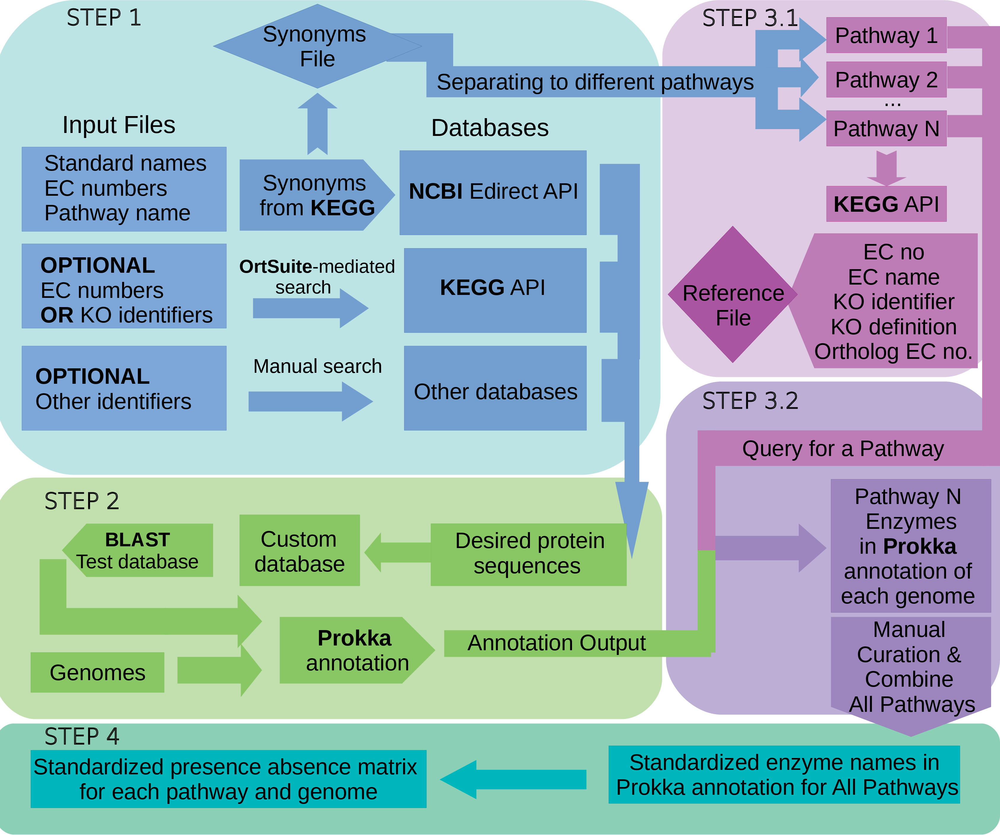
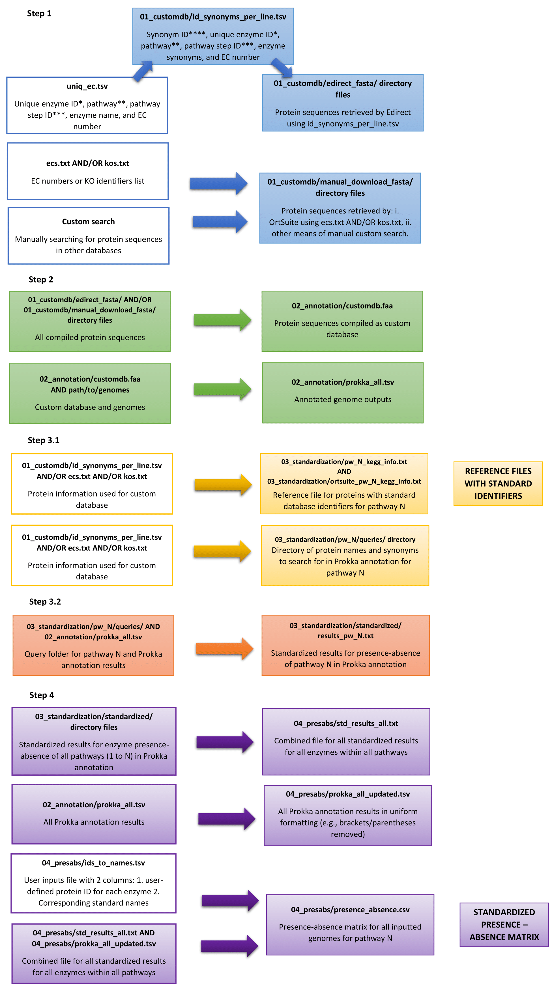

# StandEnA: A customizable workflow to create a standardized presence/absence matrix of annotated proteins

## Introduction
This workflow was created to predict and annotate proteins 
from genomes and to build a standardized matrix of presence/absence from the annotated proteins.
The outcome of this workflow can be used for many purposes. For example, to infer the genetic potential 
of a given organism to perform a pathway of interest.

<p align="center">

</p>

**Workflow of StandEnA:** Starting with enzyme identifiers for the pathways of interest, StandEnA has four steps: 
Step 1 compiles enzyme synonyms and identifiers for these pathways from various databases. Step 2 creates a custom database from these enzyme protein sequences and annotates genomes. Step 3.1 creates a reference file with cross-database identifiers for each enzyme synonym used in the annotation and step 3.2 lists all of the enzymes of interest within the annotated genomes. Step 4 generates a standardized presence absence matrix for each enzyme within the desired pathway.

**Input and Output File Structure of StandEnA:** Refer to this figure for input and output files used at each step. The column structure of the figure is as follows: 1. input file name and description for specific step, 2. output file name and description for specific step, 3. description of the significance of the output for the pipeline. Color-filled boxes indicate files generated by StandEnA whereas the white background boxes indicate the files manually inputted by the user. Each input - output file pair is ordered according to its sequence of appearance in the pipeline and is seen under the corresponding main step number in line with the above figure.

The different inputs and outputs for each step are summarized in the figure below:

<p align="center">

</p>

In **step 1**, the user inputs the [uniq_ec.tsv](examples/01_customdb/uniq_ec.tsv) file containing enzyme information separated by tab characters in this order: unique enzyme ID, pathway name, pathway step ID, enzyme name, and its enzyme commission (EC) number. Unique enzyme ID* and pathway step ID** are dependent on the naming convention preferred by the user. These IDs must be given using a consistent alphanumeric naming convention with no whitespace characters within the names. Pathway step ID*** is named according to the pathway number and the step at which the enzyme is working (e.g., pathway 1 step 1 is 1.1). This file is used to generate [01_customdb/id_synonyms_per_line.tsv](examples/01_customdb/id_synonyms_per_line.tsv) file containing the same information as the uniq_ec.tsv with the addition of available synonyms for each enzyme standard name from the KEGG database and the unique synonym ID**** for each of the retrieved synonyms. Synonym ID is a variation of unique enzyme ID to differentiate synonyms of the same enzyme. This information is used to retrieve protein sequences from the NCBI database via the Edirect application programming interface (API) and stored in the [01_customdb/edirect_fasta/](examples/01_customdb/edirect_fasta/) directory. Alternatively, the user can input EC numbers or KEGG Orthology (KO) identifiers within [ecs.txt](examples/01_customdb/ecs.txt) or [kos.txt](examples/01_customdb/kos.txt) files to retrieve protein sequences from KEGG database via OrtSuite. Furthermore, users are provided the option to use any means to download desired protein sequences from other databases which will be combined with the protein sequences downloaded by OrtSuite and stored within *01_customdb/manual_download_fasta/* directory.

In **step 2**, all protein sequences compiled in step 1 (within *01_customdb/manual_download_fasta/* and [01_customdb/edirect_fasta/](examples/01_customdb/edirect_fasta/)) are used to generate the custom database (*02_annotation/customdb.faa*). This database is used for genome annotation by Prokka along with its default database to generate the output [02_annotation/prokka_all.tsv](examples/02_annotation/example_prokka_all_results.tsv). 

In **step 3.1**, the files from step 1 ([01_customdb/id_synonyms_per_line.tsv](examples/01_customdb/id_synonyms_per_line.tsv), [ecs.txt](examples/01_customdb/ecs.txt), [kos.txt](examples/01_customdb/kos.txt)) are used to generate a reference file containing standard database identifiers for each enzyme including the EC number, standard enzyme name from KEGG, KO identifier, and enzyme synonyms used for the search with their EC numbers. Since some enzymes are defined by multiple EC numbers in KEGG, the last field sometimes contains additional EC numbers for the same enzyme. One reference file is generated for each pathway and compiled in the [03_standardization/pw_N_kegg_info.txt](examples/03_standardization/pw_1/pw_6_C_kegg_info.txt), [03_standardization/ortsuite_pw_N_kegg_info.txt](examples/03_standardization/pw_1/ortsuite_pw_1_kegg_info.txt), and/or *03_standardization/manual_pw_N_kegg_info.txt* for Edirect retrieved, OrtSuite retrieved and manually downloaded files, respectively. Moreover, the same files from step 1 are used to generate query files within the [03_standardization/pw_N/queries/](examples/03_standardization/pw_1/queries/) directory listing the possible synonym names for each enzyme.  In step **3.2**, [03_standardization/pw_N/queries/](examples/03_standardization/pw_1/queries/) files are used to select the matching annotations in [02_annotation/prokka_all.tsv](examples/02_annotation/example_prokka_all_results.tsv). The results are dumped to [03_standardization/standardized/results_pw_N.txt](examples/03_standardization/pw_1/results/standardized/) files. 

In **step 4**, [03_standardization/standardized/results_pw_N.txt](examples/03_standardization/pw_1/results/standardized/) is used to generate a standardized presence - absence matrix for all inputted genomes for pathway N. Alternatively, annotated enzymes from multiple pathways can be used to generate a single standardized presence - absence matrix. For this purpose, the [03_standardization/standardized/](examples/03_standardization/pw_1/results/standardized/) results are merged into *04_presabs/std_results_all.txt*. [02_annotation/prokka_all.tsv](examples/02_annotation/example_prokka_all_results.tsv) is processed to remove any problematic punctuation such as brackets and parentheses. This processed output file, *04_presabs/prokka_all_updated.tsv*, is used along with a user inputted file, (*04_presabs/ids_to_names.tsv*)[examples/04_presabs/ids_to_names.tsv], containing user-defined unique protein ID for each enzyme and corresponding standard protein names to be used in the standardized presence - absence matrix generation. The standardized presence - absence matrix output is generated in the file [04_presabs/presence_absence.csv](examples/04_presabs/example_presence_absence.csv).

## GitHub Contents
- [Introduction](#introduction)
- [Installation instructions](#installation-instructions)
- [Dependencies](#dependencies)
- [System requirements and usage](#system-requirements-and-usage)
- [Workflow steps](#workflow-steps)
- [Contributions](#contributions)

## Installation instructions
Clone this repository
```bash
git clone https://github.com/mdsufz/std_enzymes
```
Install Miniconda3 and add channels
```bash
wget https://repo.anaconda.com/miniconda/Miniconda3-latest-Linux-x86_64.sh
bash Miniconda3-latest-Linux-x86_64.sh

conda config --add channels defaults
conda config --add channels bioconda
conda config --add channels conda-forge
```
Create and activate conda environment
```bash
conda create -n std_enzymes python=3.6.13 perl-lwp-simple perl-lwp-protocol-https prokka blast==2.9.0
```

Set Perl 5.22.0 default path for libraries
```bash
conda env config vars set PERL5LIB=$CONDA_PREFIX/lib/perl5/site_perl/5.22.0/ -n std_enzymes
```

Activate environment
```bash
conda activate std_enzymes
```

Install required packages inside the environment
```bash
conda install -c bioconda perl-lwp-simple prokka blast==2.9.0
```
## Dependencies
To manually download additional proteins using KEGG database identifiers, OrtSuite is required. 
Follow the installation steps for OrtSuite [here](https://github.com/mdsufz/OrtSuite/).

## System requirements and usage
A typical desktop (Linux) computer is capable of performing this workflow.
Disk space can be the most limiting resource for the annotation step as each annotated genome produces ~2 G of data. Therefore, it is recommended to have a fair ammount of free space depending on the number of genomes to be annotated.


## Workflow steps
StandEnA is divided into 4 steps:

Step 1 - [Compiling Protein sequences for the custom database from NCBI, KEGG and other databases](#step-1-compiling-protein-sequences-for-the-custom-database-from-ncbi-kegg-and-other-databases)

Step 2 - [Generating a custom database and annotating genomes using Prokka with this custom database](#step-2-generating-a-custom-database-and-annotating-genomes-using-prokka-with-this-custom-database)

Step 3 - [Generating the Reference File for enzymes used in the annotation and standardizing protein names in Prokka results](#step-3-generating-the-reference-file-for-enzymes-used-in-the-annotation-and-standardizing-protein-names-in-prokka-results)
  
  Step 3.1 - [Generating reference files and query files for each enzyme standard name](#step-31-generating-reference-files-and-query-files-for-each-enzyme-standard-name)
  
  Step 3.2 - [Performing queries and standardizing annotation results](#step-32-performing-queries-and-standardizing-annotation-results)

Step 4 - [Generating matrix of standardized presence absence](#step-4-generating-matrix-of-standardized-presence-absence)

### Step 1 Compiling Protein sequences for the custom database from NCBI, KEGG and other databases

This step is necessary to extend the scope of proteins that Prokka uses by default to annotate genomes. 
For that, prepare a list of synonyms for all enzymes of interest and download them from NCBI.
This database will be called custom database (custom_db.faa) in later steps.

#### Step 1.1 Using KEGG API to retrieve enzyme synonym names

Make the new working directory and switch to this directory:
```bash
mkdir 01_customdb
cd 01_customdb
```
Prepare a tab separated file following the example [uniq_ec.tsv](examples/01_customdb/uniq_ec.tsv). A tab-separated values file is a text format similar to comma-separated values files where, instead of a comma, a tab character is used to separate different fields. Please find more information on this file structure [here](https://en.wikipedia.org/wiki/Tab-separated_values). 

Columns in this file should contain: unique enzyme ID, pathway, pathway step ID, enzyme name, and EC number. Later, some of those columns will be used to organize the download of protein sequence files.

Note that the unique enzyme ID and pathway step ID are provided by the user for their pathway of interest. In the example file, unique enzyme ID is provided using the convention E01, E02 etc. while the pathway step ID is named according to the pathway number and the step at which the enzyme is working at (e.g., pathway 1 step 1 is 1.1). Depending on the users' preferences, other naming conventions can be used in place of this provided that the column order does not change. However, each ID needs to be unique.

Please be aware that trailing spaces might exist depending on how you generated the file (e.g. Windows OS). Trailing spaces are space characters found at the end of a line which causes a problem during synonym retrieval from the KEGG database in the later steps. 

To check for trailing spaces do:

```bash
cat -v uniq_ec.tsv
```
If there are any, the symbol ^M should appear at the end of the line. To remove this:

```bash
mv uniq_ec.tsv > temp_file.tsv
sed -e "s/\r//g" temp_file.tsv > uniq_ec.tsv
```

Now the file is free of trailing whitespaces.

After preparing this file, retrieve the enzyme/protein synonyms for each name in the uniq_ec.tsv file from KEGG using their API.
Please note that any typo or extra character (e.g. space) in the EC number field of the uniq_ec.tsv file may cause no synonyms to be returned from KEGG API.
```bash
# Retrieve synonyms from KEGG API
cut -f5 uniq_ec.tsv | while read line; do out=$(curl -s https://rest.kegg.jp/list/ec:$line); echo $line $out; done > ec_synonyms.txt

# Combine tables
paste uniq_ec.tsv <(cut -f3- -d' ' ec_synonyms.txt) > synonyms_table.tsv
```

#### Step 1.2 Preparing the list of synonyms for NCBI Edirect
Parsing the synonyms to write down one synonym per line and removing "gene name", "incorrect" and "misleading" flags retrieved with the synonyms:
```bash
# Parsing the synonyms and removing output that can't be used 

perl -ne 'chomp; @fields=split("\t",$_); @syn=split(";",$fields[4]); unless(scalar(@syn)==0){foreach(@syn){print join("\t",@fields[0..3]),"\t$_\n"}}else{print "$_\t$fields[2]\n"};' <(cut -f1,3- synonyms_table.tsv) | sed -e 's/\t /\t/g' | grep -v "incorrect\|gene name\|misleading" > synonyms_per_line.tsv
```

For some enzymes that did not return synonyms because of any reason, *manually insert the enzyme names that you know in column 5 of synonyms_per_line.tsv*.

Now, the following command will create a new column and add new IDs for synonyms (first column) that will be used to name the fasta files when using Edirect:
```bash
cat synonyms_per_line.tsv | perl -ne '$line=sprintf("%03d",$.); @fields=split("\t",$_); $synid="S$line-$fields[0]-$fields[3]"; if($fields[3] eq "NA"){print "$synid\t",join("\t",@fields[0..3]),"\t$fields[2]\n"}else{print "$synid\t$_"}' > id_synonyms_per_line.tsv
```

#### Step 1.3 Manually curating the list
Look through the "id_synonyms_per_line.tsv" and check for potential problems. (eg.: too short names that can cause ambiguity)

The following command removes synonyms with less than 6 characters to avoid ambiguity when querying NCBI.
```bash
# This perl code writes the changes in the same file
perl -ne 'chomp; @fields=split("\t",$_); $fields[5] =~ tr/ //d; unless(scalar(split("",$fields[5]))<=5){print "$_\n"};' id_synonyms_per_line.tsv > tmp; mv tmp id_synonyms_per_line.tsv 
```
Note that KEGG synonyms containing ";" in their names will be separated as different synonyms. The user is advised to check for such instances and manually curate the "id_synonyms_per_line.tsv" to remove ";" characters.

#### Step 1.4 Using a custom perl script to download proteins from NCBI Edirect API
This custom script is based on the following example application: [Sample Applications of the E-utilities - Entrez Programming Utilities Help - NCBI Bookshelf](https://www.ncbi.nlm.nih.gov/books/NBK25498/#chapter3.Application_3_Retrieving_large)

This following code will run the "bulk_edirect_custom.pl" script. This script is available [here](scripts/bulk_edirect_custom.pl).

If you are on *high-performance computer cluster using SLURM as the workload manager*, do not forget to load the modules. If not, do not run the below code.
```bash
# Loading module
module load foss/2019b Perl/5.30.0
```
To run the script on your *high-performance computer cluster or local computer*, execute this code: 

```bash
# Create a folder to store downloaded fasta files
mkdir edirect_fasta
```

```bash
# Running the script
echo "START: $(date)"; cat id_synonyms_per_line.tsv | while read line; do id=$(echo "$line" | cut -f1); reac=$(echo "$line" | cut -f6 ); perl ../../scripts/bulk_edirect_custom.pl "$reac" protein $id edirect_fasta/ >> log.txt 2>> err.txt; done; echo "  END  : $(date)";
```
Since it can take hours or even days depending on the size of your list, I recommend running this with help of another tool (e.g. "screen"). To get more information on the screen tool, visit [this website](https://www.gnu.org/software/screen/).

Do not try to run many instances in parallel (e.g., multiple id_synonyms_per_line.tsv files used to access the Edirect API at the same time). 
This may cause NCBI to black list your IP in which case the log.txt file from this step may contain "RESULTS: ERROR" output for your queries. If this is the case, stop the execution and retry at a later time. If the error persists, you may need to contact NCBI Edirect services.  


#### Step 1.5 Adding missing proteins to custom database through OrtSuite-mediated searching in KEGG or manual downloading from other databases 

This step is necessary if there are enzymes that were not collected by Edirect in the previous step. Otherwise, you can skip this step and continue with the Edirect downloaded proteins to perform the later steps.

For example, you can download some proteins that did not get downloaded by Edirect from the above-step or additional proteins that you want to retrieve from KEGG Orthology directly using their EC numbers or KO identifiers. For the latter, the workflow uses OrtSuite. 


Create a folder to store manually downloaded fasta files
```bash
mkdir manual_download_fasta/
```

##### Downloading proteins using OrtSuite

For this step to be executed, OrtSuite must be installed as described [here](https://github.com/mdsufz/OrtSuite). For further information, we recommend checking the OrtSuite GitHub to learn how to use the download_kos command that is used in this step.

Note that you must be at the OrtSuite environment in conda if you followed the conda installation [here](https://github.com/mdsufz/OrtSuite#readme).
Example files for ecs.txt and kos.txt can be found in [OrtSuite GitHub](https://github.com/mdsufz/OrtSuite/tree/master/examples) and in the [ecs.txt](examples/01_customdb/ecs.txt) and [kos.txt](examples/01_customdb/kos.txt) files for the example case used in this pipeline.

```bash
# Downloading protein sequences based on a list of EC numbers
download_kos -o manual_download_fasta/ -e ecs.txt > log_ecs.txt 2> err_ecs.txt

# Downloading protein sequences based on a list of KO numbers
download_kos -o manual_download_fasta/ -k kos.txt > log_kos.txt 2> err_kos.txt
```
Note that if the same list of proteins are using both EC and KO numbers, the files initially downloaded files will be overwritten because the file naming convention for this step uses the KO numbers for both methods. It is suggested to save the files to a new directory (e.g., manual_download_fasta_new/) to avoid this.

##### Manually downloading proteins from other sources

Also, we demonstrate the user-customizability and flexibility of the custom database creation of StandEnA by manually downloading a couple of protein sequence files from various different databases. This step is important when the automated retrieval in the previous steps do not work for some of the desired proteins or there are other specific databases that you want to use to retrieve protein sequences.

Manually search for proteins in various databases (eg.: Uniprot, NCBI and KEGG) and save them into FASTA files. Note that protein sequences are found within .faa extension files and this file type is recommended for this step. However, in some cases, databases may only provde the option of downloading protein sequence files in the generic .fasta or .fa format. In this case, make sure that the contents of these files are protein sequences rather nucleic acid sequences. For more information on different FASTA formats and file extensions visit [this page](https://en.wikipedia.org/wiki/FASTA_format). 

```bash
# Example
 01_ana_benzene_carboxylase.faa
 02_benzoyl-coa_bamD.faa
 02_benzoyl-coa_bamE.faa
 02_benzoyl-coa_bamF.faa
 02_benzoyl-coa_bamG.faa
 02_benzoyl-coa_bamH.faa
 02_benzoyl-coa+reductase+bami.faa
 04_uniprot-Nitric+oxide+dismutase+(putative).faa
```
Note that these sequences must be saved these to the manual_download_fasta/ directory to be used in later steps.


### Step 2 Generating a custom database and annotating genomes using Prokka with this custom database

In this part, we are going to annotate our genomes using Prokka
with the additional custom database to be created from the downloaded proteins in [step 1](#step-1-compiling-protein-sequences-for-the-custom-database-from-ncbi-kegg-and-other-databases).


#### Step 2.1 Creating the work directory
Create the directory where Prokka annotation results will be saved to.
```bash
cd ..
mkdir 02_annotation
cd 02_annotation
```
Note that this directory should not be within the 01_customdb/ directory but in another parent directory beside 01_customdb/. The directory organization is exemplified [here](examples). The same directory organization must be followed throughout the pipeline.

#### Step 2.2 Creating the custom database
In the next step, we combine the additional [downloaded proteins](#step-15-adding-missing-proteins-to-custom-database-through-ortsuite-mediated-searching-in-kegg-or-manual-downloading-from-other-databases) into a custom database.

```bash
# Example (make sure to check the extensions of the files so you can use the wildcard)
cat ../01_customdb/edirect_fasta/*.faa ../01_customdb/manual_download_fasta/*.faa > custom_db.faa
```
Note that if some files that have been manually downloaded in the previous step have different file extensions (e.g., download_kos function downloads files with .fa extension), they would not be added to the custom_db.faa with this code. Change the above code like this if there are files with .fa extensions. For more information on different permitted file extensions, refer to [step 1.5](#step-15-adding-missing-proteins-to-custom-database-through-ortsuite-mediated-searching-in-kegg-or-manual-downloading-from-other-databases).

```bash
# Example if there are .faa and .fa files in the manual_download_fasta/ directory
cat ../01_customdb/edirect_fasta/*.faa ../01_customdb/manual_download_fasta/*.faa ../01_customdb/manual_download_fasta/*.fa > custom_db.faa
```

#### Step 2.3 Testing the custom database
To test if the newly created database is "flawless", simply run "makeblastdb" on it.

```
makeblastdb -dbtype prot -in custom_db.faa -out custom_db
```

If you get an error like "BLAST Database creation error", something might be wrong with your database.
In our case, we identified some problematic lines and manually removed those.

An example on how to identify problematic lines and to fix them. Please be aware that this may not fix your specific problem:
```bash
# Looking for "problematic" lines
sed -e  's/>/\n>/g' custom_db.faa | grep -P "\w>"
# Fixing those lines
sed -i  's/>/\n>/g' custom_db.faa
```

#### Step 2.4 Shortening contig names
Prokka does not work when FASTA sequences have long headers (> 20 characters long). 
Therefore, it is necessary to rename the headers of 
the fasta files which will be used as input for annotation.

```bash
# Create a directory to store the renamed genomes
# Here we call it "short"
mkdir short

# Move to the folder where your genomes are
cd /path/to/genomes

# This awk command does the trick of renaming the fasta headers
# awk is taking each fasta as input and outputing to the directory short
for i in *; do awk '/^>/{print ">contig" ++i; next}{print}' < $i > path/to/02_annotation/short/"short_"$i; done
```

#### Step 2.5 Running Prokka on genomes using the custom database

There are 2 alternative methods to run Prokka on genomes depending on your computational resources:

##### Runing Prokka on your local machine

Changing working directory to the directory containing the shortened genomes (from previous step):
```bash
cd /path/to/short
```
Note that this step can only be done after Prokka installation witin the std_enzymes conda environment as described under the [Installation instructions](#installation-instructions) heading. Please make sure that the std_enzymes conda environment is activated as stated in the instructions to proceed with this step.

Running Prokka for genomes:
```bash
for k in *.fa; do prokka $k --outdir prokka_out/"$k".prokka.output --prefix PROKKA_${k##*/} --proteins "custom_db.faa" --norrna --notrna --cpus 4 ; echo $k; done
```
Note that depending on your machine resources you can increase the cpu number to be used from --cpus option. See [Prokka](https://github.com/tseemann/prokka#readme) help page for detailed information on the flags used in the above code.
This step puts all genome annotation files to the location 02_annotation/prokka_out/short.

##### Running Prokka on a high-performance computing cluster

The following for loop will submit a job on a high-performance computing cluster *using SLURM as a workload manager* for each genome to be annotated.
```bash
# Define working directory
workdir=/path/to/02_annotation
# Define prokka submission script
subscript_prokka=/path/to/prokka_on_bioindicators_v2.sh

for i in *.fa; do qsub -N $i $subscript_prokka $workdir/rep_set/short/$i prokka_out/"out_$i" $i; done
```
The submission script (which has the commands used) is available [here](scripts/prokka_sub_script.sh).

**Please note that this submission script contains path/to/ fillers in place of personal data and paths in the server. All of that must be replaced by your own information before running the script. 


#### Step 2.6 Compiling all Prokka annotation results into a single file

The most important output for our further analysis is the ".tsv" file 
(read about Prokka output files [here](https://github.com/tseemann/prokka#output-files)). A tab-separated values file is a text format similar to comma-separated values files where, instead of a comma, a tab character is used to separate different fields. Please find more information on this file structure [here](https://en.wikipedia.org/wiki/Tab-separated_values).

Concatenate all your ".tsv" outputs together.
```bash
# Concatenate files while printing filenames to first column
awk '{print FILENAME "\t" $0}' /path/to/prokka_out/*/*.tsv > prokka_all.tsv
```
Note that /path/to/prokka_out/*/*.tsv is 02_annotation/short/prokka_out/*/*.tsv if the code has been run on local machine.

Optional but recommended step: Formating genome names from results.
```bash
sed -ri -e 's/^out_short_//' -e 's/\/PROKKA_[0-9]+\.tsv//' prokka_all.tsv
sed -ri '1 s/\S+/bin_id/' prokka_all.tsv
```

### Step 3 Generating the Reference File for enzymes used in the annotation and standardizing protein names in Prokka results

If you have many different pathways, 
we suggest doing this part separately for each pathways.
That way, you will end up having less proteins at a time
which will make the process faster.
Additionally, since some steps are manual, too many proteins at once can be confusing for users.

#### Step 3.1 Generating reference files and query files for each enzyme standard name

##### Step 3.1.1 Subsetting data to work with one pathway at a time

Creating directory for this part:
```
mkdir ../../03_standardization
cd ../../03_standardization
```
Note that the working directory in [step 2.6](#step-26-compiling-all-prokka-annotation-results-into-a-single-file) is 02_annotation/short/.

For example, when working with pathway of interest "1", create a working directory and other files following the naming convention "pw_1". 

Creating directory for pathway 1:
```bash
mkdir pw_1
cd pw_1
```

Saving unique enzyme standard names and their synonyms for this pathway which were compiled into the [01_customdb/id_synonyms_per_line.tsv](examples/01_customdb/id_synonyms_per_line.tsv) in [step 1.2](#step-12-preparing-the-list-of-synonyms-for-ncbi-edirect): 
```bash
grep -P "\t1\.\d\t" ../../01_customdb/id_synonyms_per_line.tsv | cut -f4,5,6 | cut -f1,3 | sort | uniq > pw_1.txt
```
For this example, enzymes within pathway 1 have an enzyme ID starting with "1.". Hence, to retrieve these, the id_synonyms_per_line.tsv file is searched for the text "\t1\.\d\t" by this code. Note that the enzyme list for reference file and query file formation is derived from the file "id_synonyms_per_line.tsv" that was used to download protein sequences using Edirect API in [step 1.4](#step-14-using-a-custom-perl-script-to-download-proteins-from-ncbi-edirect-api). For example, if pathway 2 is to be retrieved, the above line should be updated to search for "\t2\.\d\t" (i.e., instead of "\t1\.\d\t" enter "\t2\.\d\t") and the output file should be named accordingly (pw_2.txt).  

Note that query formation in later steps from pw_1.txt will give an error if the file contains names with "/". These must be replaced by another character (e.g., in place of "/" put "_").

```bash
#Replace all "/" with "_"
mv pw_1.txt temp_file.txt
sed -r "s/[/]+/_/g" temp_file.txt > pw_1.txt

#Remove intermediate files
rm temp_file.txt
```

Since the OrtSuite-mediated KEGG API download and manual download steps are performed after Edirect download and are optional, if manual download steps are used to retrieve sequences that are not included within [id_synonyms_per_line.tsv](examples/01_customdb/id_synonyms_per_line.tsv), additional steps should be performed to account for these protein names. In the steps below, there are additional codes to be executed to add OrtSuite-mediated KEGG API downloaded proteins (from EC numbers) to the required files and directories. These steps can be modified by the user if there are other download methods used (e.g., OrtSuite-mediated KEGG API downloaded proteins from KO identifiers). These steps can be skipped altogether if there are no OrtSuite-mediated KEGG API downloaded proteins (from EC numbers) or manually proteins downloaded from different databases or if all enzyme information was inputted to the pipeline via the initial "uniq_ec.tsv" file in [step 1.1](#step-11-using-kegg-api-to-retrieve-enzyme-synonym-names) which is used to generate the [id_synonyms_per_line.tsv](examples/01_customdb/id_synonyms_per_line.tsv) file in [step 1.2](#step-12-preparing-the-list-of-synonyms-for-ncbi-edirect). 


##### Step 3.1.2 Dividing pathways into separate files for each enzyme/protein and collecting them in the queries directory

Each pathway will have a "queries" directory of files containing the enzyme synonyms to be searched for in the Prokka annotation in later steps.

Creating directory for storing queries:
```bash
mkdir queries
```

Printing each collection of synonyms to a different file:
```bash 
cat pw_1.txt | while read -r l; do line=$l; col2=$(echo "$l" | cut -f2); name=$(echo "$l" | cut -f1 | tr ' ' '_'); echo $col2 | tr -d '[]()*'| tr '[:upper:]' '[:lower:]' >> queries/$name.txt ; done
```
Note that this step removes all brackets and changes the queries to lowercase letters for uniformity.

Removing duplicated synonyms:
```bash
for i in queries/*; do sort $i | uniq > queries/tmp; mv queries/tmp $i; done
```
###### Example query file formation for OrtSuite-mediated KEGG API downloaded proteins (from EC numbers)
To be able to form query files, the EC numbers in ecs.txt must be used to retrieve enzyme names and synonyms. The below code is a variation of the [step 1.1](#step-11-using-kegg-api-to-retrieve-enzyme-synonym-names) to demonstrate the customizability and flexibility of the code depending on specific needs. Please refer back to step 1 for detailed explanations.  

From this file, the enzyme synonyms and standard names can be added to files in the queries folder:
```bash 
cat path/to/ecs.txt | while read line; do out=$(curl -s https://rest.kegg.jp/list/ec:$line); echo $line $out; done > ortsuite_ec_synonyms.txt
```
After the synonyms and standard names have been collected into ortsuite_ec_synonyms.txt, we advise you to manually create a file similar to [uniq_ec.tsv](examples/01_customdb/uniq_ec.tsv) containing the unique enzyme ID, pathway, pathway step ID, enzyme name, and EC numbers. Note that the enzyme name is the first name retrieved in ortsuite_ec_synonyms.txt and the fields unique enzyme ID, pathway, pathway step ID are dependent on the uniq_ec.tsv naming convention. The example file can be found here: [ortsuite_uniq_ec.tsv](examples/03_standardization/pw_1/ortsuite_uniq_ec.tsv). 

For the later steps to be executed smoothly, the file must be generated using the EC number order in ortsuite_ec_synonyms.txt. The user should manually curate ortsuite_ec_synonyms.txt file first to remove any irrelevant EC numbers or synonyms in ortsuite_ec_synonyms.txt that might have been retrieved from KEGG to proceed with the information that you used to construct ortsuite_uniq_ec.tsv.

Then, the steps for the creation of ortsuite_id_synonyms_per_line.tsv are followed from [step 1](#step-1-compiling-protein-sequences-for-the-custom-database-from-ncbi-kegg-and-other-databases):

```bash
paste ortsuite_uniq_ec.tsv <(cut -f3- -d' ' ortsuite_ec_synonyms.txt) > ortsuite_synonyms_table.tsv
perl -ne 'chomp; @fields=split("\t",$_); @syn=split(";",$fields[4]); unless(scalar(@syn)==0){foreach(@syn){print join("\t",@fields[0..3]),"\t$_\n"}}else{print "$_\t$fields[2]\n"};' <(cut -f1,3- ortsuite_synonyms_table.tsv) | sed -e 's/\t /\t/g' | grep -v "incorrect\|gene name\|misleading" > ortsuite_synonyms_per_line.tsv
cat ortsuite_synonyms_per_line.tsv | perl -ne '$line=sprintf("%03d",$.); @fields=split("\t",$_); $synid="S$line-$fields[0]-$fields[3]"; if($fields[3] eq "NA"){print "$synid\t",join("\t",@fields[0..3]),"\t$fields[2]\n"}else{print "$synid\t$_"}' > ortsuite_id_synonyms_per_line.tsv
perl -ne 'chomp; @fields=split("\t",$_); $fields[5] =~ tr/ //d; unless(scalar(split("",$fields[5]))<=5){print "$_\n"};' ortsuite_id_synonyms_per_line.tsv > tmp; mv tmp ortsuite_id_synonyms_per_line.tsv
```
From this file, queries can be added to the queries directory following the same steps for the id_synonyms_per_line.tsv file above (starting from [step 3.1.1](#step-311-subsetting-data-to-work-with-one-pathway-at-a-time)) by changing the input to ortsuite_id_synonyms_per_line.tsv. Note that the file names for the OrtSuite-mediated KEGG API downloaded proteins are advised to be distinguished from Edirect downloaded proteins in the query file via a naming convention (e.g., queries/ortsuite_$name.txt for the file names to include "ortsuite"). The same naming convention is advised to be used for the intermediate files (e.g., ortsuite_pw_1.txt) to prevent overwriting the files created for Edirect downloaded proteins.


##### Step 3.1.3 Collecting standard database identifiers about the enzyme names used during annotation from KEGG to generate a reference file
The goal of this step is to generate the file "kegg_info.txt" for the
given pathway. This file can be used as a reference while manually curating the
protein names during the presence absence matrix generation in [step 4.2](#step-42-manually-preparing-file-of-proteinenzyme-names-to-be-used-for-generating-the-presence-absence-matrix).


Gathering unique EC numbers for the pathway:
```bash 
grep -P "\t1\.\d\t" ../../01_customdb/id_synonyms_per_line.tsv | cut -f4,5 | sort | uniq > unique_pw_ec.tsv
```
Note that if pathway 2 is to be retrieved, the above line should be updated to search for "\t2.\d\t".

Note that for some enzyme names in id_synonyms_per_line.tsv there might be no EC identifier. In this case, the user should use the below line to remove any "NA" or "-" identifier:
```bash
grep -v ".-" uniq_pw_ec.tsv | grep -v "NA$" > uniq_pw_ec_edited.tsv

```

Collecting ECs and KOs from KEGG API:
```bash
cat unique_pw_ec.tsv | cut -f2 | while read l; do curl -s https://rest.kegg.jp/link/ko/ec:$l; done | sort -k1,2 | uniq | grep -v "^$" > pw_ec_kos.txt
```

Collecting KO definitions (protein names):
```bash 
cut -f2 pw_ec_kos.txt | while read l; do def=$(curl -s https://rest.kegg.jp/get/$l | grep NAME | cut -f3- -d " "); paste <(echo $l) <(echo $def); done > kos_def.txt
```

Collecting main EC name (enzyme name):
```bash
cut -f1 pw_ec_kos.txt | while read l; do def=$(curl -s https://rest.kegg.jp/list/$l | cut -f2 | cut -f1 -d ";"); paste <(echo $l) <(echo $def); done > ec_name.txt
```

Combining all in a single file:
```bash
paste ec_name.txt kos_def.txt > pw_1_kegg_info.txt
```

Cleaning intermediate files (optional):
```bash
rm pw_ec_kos.txt kos_def.txt ec_name.txt
```
###### Example reference file formation for OrtSuite-mediated KEGG API downloaded proteins (from EC numbers)

Collecting ECs and KOs from KEGG API:
```bash
cat ecs.txt | while read l; do curl -s https://rest.kegg.jp/link/ko/ec:$l; done | sort -k1,2 | uniq | grep -v "^$" > ortsuite_ec_kos.txt
```
After this step, ortsuite_ec_kos.txt file can be used in place of pw_ec_kos.txt in the above steps (3) Collecting standard database identifiers about the enzyme names used during annotation from KEGG to generate a reference file) to generate the reference file. Note that the output and input file names for each of the above steps must be changed to prevent overwriting the reference files generated for Edirect downloaded proteins listed in id_synonyms_per_line.tsv. The suggested naming convention for these files is: ortsuite_kos_def.txt, ortsuite_ec_name.txt, [ortsuite_pw_1_kegg_info.txt](examples/03_standardization/pw_1/ortsuite_pw_1_kegg_info.txt).

#### Step 3.2 Performing queries and standardizing annotation results

##### Step 3.2.1 Performing queries of the Prokka annotation using files in queries directory and dumping results into files

Changing to queries directory:
```bash
mkdir results
cd queries
```

Note: manually remove queries with brackets "[]" (if there are any). To test this:
```bash
grep -lFe [ -lFe ] -lFe "(" -lFe ")" *.txt
```
If there are file contents with brackets, the user is advised to use this code to remove the brackets but **keep the original files for later reference**.
Note that this step can be directly skipped if there are no brackets in the queries.
```bash
#This will put the files in a subdirectory called new and use these files for the rest of the steps
mkdir new
for i in *.txt; do cat $i | tr -d '[]()' > new/$i; done
#Change to new/ to execute below steps
cd new/
```

For each query file, query for terms in the complete results. This step connects the standard names generated from previous steps with the protein annotation files generated by Prokka in [step 2](#step-2-generating-a-custom-database-and-annotating-genomes-using-prokka-with-this-custom-database).
```bash
for i in *.txt; do grep -i -f $i path/to/02_annotation/short/prokka_all.tsv > path/to/results/result_$i; done
```

Moving results to a folder with complete results:
```bash
cd path/to/results
mkdir complete
mv *.txt complete
```

Summarizing result files by removing duplicates (unique):
```bash
mkdir unique
cd unique
for i in ../complete/*.txt; do cut -f8 $i | sort | uniq > $i.uniq; done; mv ../complete/*.uniq .
```

Now, the files for standardization should be ready.

Open each one of the ".uniq" files and include a new first column. Note that .uniq files use tab as the delimiter. A tab-separated values file is a text format similar to comma-separated values files where, instead of a comma, a tab character is used to separate different fields. Please find more information on this file structure [here](https://en.wikipedia.org/wiki/Tab-separated_values).

Add a first column for each line and manually annotate the standard name to the protein name of the second column.
If the second column cell does not relate to your protein, add "REMOVE" (without brackets) to the first column.

Example .uniq file:


Note that, depending on the specific protein headers present in the custom database generated in [step 2](#step-2-generating-a-custom-database-and-annotating-genomes-using-prokka-with-this-custom-database), Prokka annotation step can produce relatively "clean" outputs. This can mean that the first column that you add might contain the same information outputted by Prokka on the second column. An example "clean" .uniq file image is shown below:


##### Step 3.2.2 Combining standard names to Prokka annotation results (standardization of Prokka annotation)

Moving to results directory (going back to 03_standardization/pw_1/results/):
```bash
cd ../
```

Creating directory to store standardized results:
```bash
mkdir standardized
```

Adding standardized results to last column for each enzyme:
```bash
cd complete
for i in *; do python3 ../../../../../scripts/add_standard_names.py "../unique/$i.uniq" "$i" >> ../standardized/results_pw_1.txt; done
```

Note: The add_standard_names.py script is available [here](scripts/add_standard_names.py).


### Step 4 Generating matrix of standardized presence absence

#### Step 4.1 Combining all standardized Prokka results

Creating directory for this part and changing working directory to this:
```bash
mkdir 04_presabs
cd 04_presabs
```
Note that for [step 3.2.2](#step-322-combining-standard-names-to-prokka-annotation-results-standardization-of-prokka-annotation) the working directory is at the subdirectory 03_standardization/pw_1/results/standardized/. The relative path from this point to the directory 04_presabs is:
```bash
mkdir ../../../../04_presabs
```

Combining all standardized results
```bash
cat ../03_standardization/pw_*/results/standardized/* > std_results_all.txt
```

#### Step 4.2 Manually preparing file of protein/enzyme names to be used for generating the presence - absence matrix

Prepare a tab separated file (two columns) that contains the protein ID that you give to each of the protein standard names that you want to generate the matrix for. A tab-separated values file is a text format similar to comma-separated values files where, instead of a comma, a tab character is used to separate different fields. Please find more information on this file structure [here](https://en.wikipedia.org/wiki/Tab-separated_values).

Below is the example file ([ids_to_names.tsv](examples/04_presabs/ids_to_names.tsv)):
```
CP1001	benzene dioxygenase, alpha subunit
CP1002	benzene dioxygenase, beta subunit
CP1003	benzene dioxygenase, ferredoxin component
CP1004	benzene dioxygenase, ferredoxin reductase component
```
Note that the protein IDs are dependent on the preference of the user. Here we suggested the usage of an ID convention of CP1001, CP1002 etc. Proteins to be used for the presence absence matrix is dependent on the user input but must match the names used in Prokka annotations and synonyms search performed using the query files in [step 3.2.1](#step-321-performing-queries-of-the-prokka-annotation-using-files-in-queries-directory-and-dumping-results-into-files). As a guideline, please check the your kegg_info.txt file for Edirect downloaded proteins (example file can be found under the name [pw_6_C_kegg_info.txt](examples/03_standardization/pw_1/pw_6_C_kegg_info.txt)) and [ortsuite_pw_1_kegg_info.txt](examples/03_standardization/pw_1/ortsuite_pw_1_kegg_info.txt) for proteins downloaded from KEGG using OrtSuite.generated in [step 3.1.3](#step-313-collecting-standard-database-identifiers-about-the-enzyme-names-used-during-annotation-from-kegg-to-generate-a-reference-file).

#### Step 4.3 Running script to generate standardized presence - absence matrix
To prevent case-sensitivity as well as bracket differences while comparing the Prokka annotation with the standardized results, the Prokka annotation is recommended to be converted to lowercase and the brackets should be removed.
```bash
cat ../02_annotation/short/prokka_all.tsv |tr -d '[]()'| tr '[:upper:]' '[:lower:]' > prokka_all_updated.tsv
```

Using the ids_to_names.tsv file, run the script to generate the presence-absence matrix:
```bash
python3 ../../scripts/make_pres_abs.py std_results_all.txt ids_to_names.tsv prokka_all_updated.tsv > presence_absence.csv
```

Note: The make_pres_abs.py script is available [here](scripts/make_pres_abs.py). 

If there is a split function error stating "expected 2 got 1" or "expected 2 got more", this is likely due to the lack of the required tab character or an additional tab character within a lines within .uniq files manually curated in [step 3.2.1](#step-321-performing-queries-of-the-prokka-annotation-using-files-in-queries-directory-and-dumping-results-into-files) which is propagated to the std_results_all.txt file. In this case, go back to the 03_standardization/results/unique/ directory files and manually fix these mistakes. It is advised that the user runs this code to look at the number of columns in each file quickly:
```bash
cd ../03_standardization/pw_1/results/unique
for i in *.uniq; do awk -F'\t' '{print NF}' $i; echo $i; done
```
This code is for the example of checking the number of columns separated by tabs in the .uniq files for pathway 1. To check the rest of the pathway files, change workng directory to 03_standardization/pw_N/. The output of the code will be the name of each file searched and the number of columns found in each line within that file. The output must be **exactly 2** for each line to avoid errors. Look for lines that are less than or more than 2 and go to the specific file name that this occurence was seen to fix the problem. Additionally, the line number within the output will correspond to the line number in the .uniq file (i.e., if the line output is 3 for line number 5 in a certain file, then you can go to the same file name and look at line 5 to see the problem).

Another possible error can be "KeyError" if the ids_to_names.tsv file generated in [step 4.2](#step-42-manually-preparing-file-of-proteinenzyme-names-to-be-used-for-generating-the-presence-absence-matrix) does not match the standard names used in the standardization ([step 3.2.1](#step-321-performing-queries-of-the-prokka-annotation-using-files-in-queries-directory-and-dumping-results-into-files)). In this case, change the names in the ids_to_names.tsv names file to match the standard names in the .uniq files.

## Contributions
Authors of pipeline: Fatma Chafra, Felipe Borim Corrêa,and Ulisses Nunes da Rocha

Principal Investigator: [Ulisses Nunes da Rocha](https://www.ufz.de/index.php?de=43142)

Institution: [Microbial Data Sciences group](https://www.ufz.de/index.php?de=43659), Helmholtz Center for Environmental Research, Department of Environmental Microbiology, Leipzig, Germany

All feedback is welcome. For errors and bugs, please open a new Issue thread on this github page, and we will try to address them as soon as possible. For general feedback you can contact us at mds@ufz.de. 
