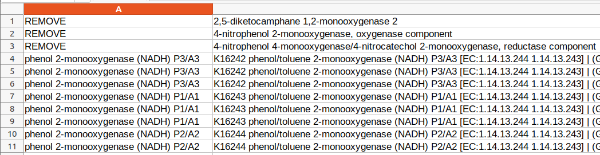
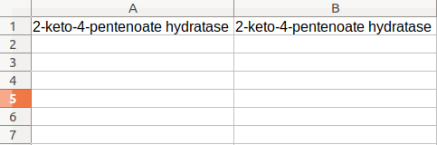

## Standardizing protein names from Prokka results

If you have many different pathways, 
I suggest doing this part for each different pathways.
That way, you will end up having less proteins at a time
and this will ease the process.
Since some steps are manual, too many proteins can be confusing.


Creating directory for this part:
```
mkdir 03_standardization
cd 03_standardization
```

#### 1) Subsetting data to work with a pathway at a time

Example. Working with pathway of interest "1".

Creating directory for pathway 1:
```bash
mkdir pw_1
cd pw_1
```

Saving unique enzyme main names and synonyms for pathway (1.[0-9]):
```bash
grep -P "\t1\.\d\t" ../../01_customdb/id_synonyms_per_line.tsv | cut -f4,5,6 | cut -f1,3 | sort | uniq > pw_1/pw_1.txt
```


#### 2) Dividing pathways into separate files for each protein

Creating directory for storing queries:
```bash
mkdir queries
mkdir pw_1/queries
```

Printing each collection of synonyms to a different file:
```bash 
cat pw_1.txt | while read -r l; do line=$l; col2=$(echo "$l" | cut -f2); name=$(echo "$l" | cut -f1 | tr ' ' '_'); echo $col2 | sed -e 's/(.*//' >> queries/$name.txt ; done
```

Removing duplicated synonyms:
```bash
for i in queries/*; do sort $i | uniq > queries/tmp; mv queries/tmp $i; done
```


#### 3) Collecting extra information from KEGG
The goal of this step is to generate the file "kegg_info.txt" for the
given pathway. This file can be used as a reference while manually curating the
protein names.


Gathering unique EC numbers for the pathway:
```bash 
grep -P "\t1\.\d\t" ../../01_customdb/id_synonyms_per_line.tsv | cut -f4,5 | sort | uniq > unique_pw_ec.tsv
```

Collecting ECs and KOs from KEGG API:
```bash
cat unique_pw_ec.tsv | cut -f2 | while read l; do curl -s https://rest.kegg.jp/link/ko/ec:$l; done | sort -k1,2 | uniq | grep -v "^$" > pw_ec_kos.txt
```

Collecting KO definitions (protein names):
```bash 
cut -f2 pw_ec_kos.txt | while read l; do def=$(curl -s https://rest.kegg.jp/get/$l | grep NAME | cut -f3- -d " "); paste <(echo $l) <(echo $def); done > kos_def.txt
```

Collecting main EC name (enzyme name):
```bash
cut -f1 pw_ec_kos.txt | while read l; do def=$(curl -s https://rest.kegg.jp/list/$l | cut -f2 | cut -f1 -d ";"); paste <(echo $l) <(echo $def); done > ec_name.txt
```

Combining all in a single file:
```bash
paste ec_name.txt kos_def.txt > pw_1_kegg_info.txt
```

Cleaning intermediate files (optional):
```bash
rm unique_pw_ec.tsv pw_ec_kos.txt kos_def.txt ec_name.txt
```


#### 4) Performing queries and dumping results into files


Changing to queries directory:
```bash
mkdir results
cd queries
```

Note: manually remove queries with brackets "[]" (if there are any)

For each query file, query for terms in the complete results
```
for i in *.txt; do grep -i -f $i ../../../02_annotation/prokka_all.tsv > ../results/result_$i; done
```
This step connects the standard names generated from previous steps with the protein annotation 
files generated by Prokka in [step 2](ANNOTATION.md).

Moving results to a folder with complete results:
```bash
cd ../results
mkdir complete
mv *.txt complete
```

Summarizing result files by removing duplicates (unique):
```bash
mkdir unique
cd unique
for i in ../complete/*.txt; do cut -f8 $i | sort | uniq > $i.uniq; done; mv ../complete/*.uniq .
```

Now, the files for standardization should be ready.

Open each one of the ".uniq" files and include a new first column.
In this column annotate the standard name to the protein name of the second column.
If the second column cell does not relate to your protein, add "REMOVE" (without brackets).

Example:



Note that, depending on the specific protein headers present in the custom database generated in step 1 (link to Preparing an extra database from NCBI step), Prokka annotation step can produce relatively "clean" outputs. This can mean that the first column that you add might contain the same information outputted by Prokka on the second column. An example image is shown below:




#### 5) Combining standard names to Prokka results

Moving to results directory (going back to 03_standardization/pw_1/results/):
```bash
cd ../
```

Creating directory to store standardized results:
```bash
mkdir standardized
```

Adding standardized results to last column for each enzyme:
```bash
cd complete
for i in *; do python3 ../../../../scripts/add_standard_names.py "../unique/$i.uniq" "$i" >> ../standardized/results_pw_1.txt; done
```

Note: The add_standard_names.py script is available [here](../scripts/add_standard_names.py).
